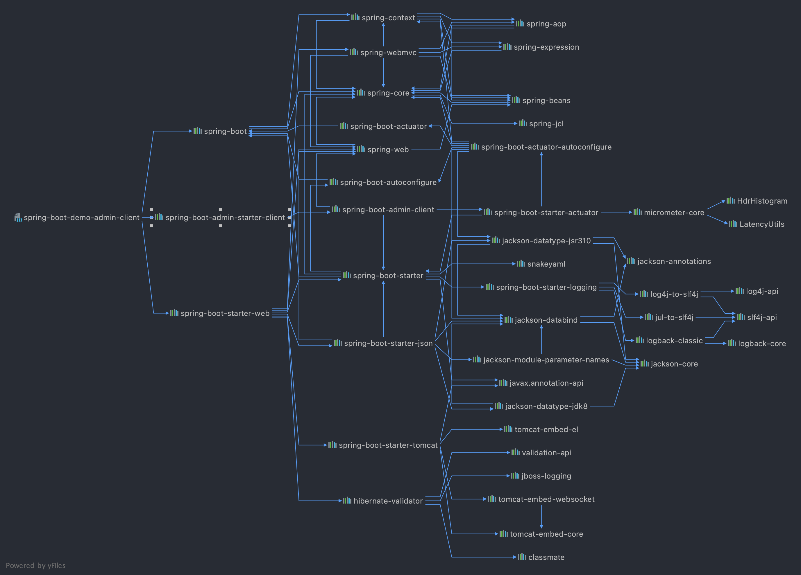

<h1 align="center">😄<a href="https://github.com/chachaxw" target="_blank">spring-boot-learning</a></h1>

A spring boot learning project

  
  
  
    

## 🔧 Development Environment

- **JDK 1.8 +**
- **Maven 3.5 +**
- **IntelliJ IDEA ULTIMATE 2020.2 +** (*Note：please use IDEA to develop，and make sure plugin `lombok` installed*)
- **Mysql 5.7 +**

## Snapshot

## ☕️ Module Info

| Module Name                                                 | Description                                                  |
| ----------------------------------------------------------- | ------------------------------------------------------------ |
| [helloworld](spring-boot-demo-hello-world/src/main/java/com/chacha/helloworld)         | a helloworld spring boot application                         |
| [properties](spring-boot-demo-properties/src/main/java/com/chacha/properties)         | read configuration content in spring boot application        |
| [spring boot admin client](spring-boot-demo-admin-client/src/main/java/com/chacha/admin/client)  | spring boot admin client module        |
| [spring boot admin server](spring-boot-demo-admin-server/src/main/java/com/chacha/admin/server)  | spring boot admin server module        |
| [spring boot exception handler](spring-boot-demo-exception-handler/src/main/java/com/chacha/exception)  | spring boot exception handler module        |
| [spring boot log aop](spring-boot-demo-log-aop/src/main/java/com/chacha/log/aop)  | spring boot log aop demo        |
